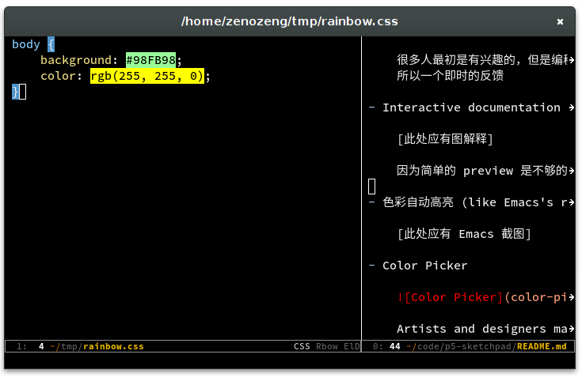
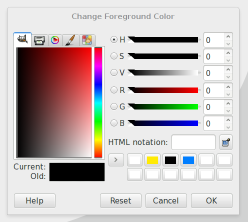

# p5-sketchpad

Browser based p5.js IDE designed to
make coding accessible for artists, designers, educators, and beginner.

## Features

### Basic

- Offline usability

    Using appcache, localStorage and indexeddb.

- Auto completion for standard JavaScript and p5.js.

    And Icons for each shape. [此处应有草图]

- JSHint / JSLint

- Syntax Highlight

### Import and Export

- Templates for new project

- Drag files in

- IndexedDB / LocalStorage based session

- Gif / PDF export

### Live Preview

- Live preview for current project

    很多人最初是有兴趣的，但是编程一开始的没有反馈会给他们带来挫败的感觉。
    所以一个即时的反馈

- Interactive documentation for current function and current params

    [此处应有图解释]

    因为简单的 preview 是不够的，没有到那一帧就看不到，要等到。

- 色彩自动高亮 (like Emacs's rainbow mode)

    

- Color Picker

    

    Artists and designers may not have direct feeling for RGB.
    A color picker may be better for them.
    When click on expression like `background(255, 255, 255)`,
    a color picker will be displayed to help them choose the desired color.

### Social

- Share current project with a link (Node.js)

    用于 demo，设计师会非常常用这个

## FAQ

### Why browser based?

因为就我目前的观察，很多人会在下载 IDE 和安装使用他们的时候就感到挫败。
而且在浏览器还有个好处就是甚至可以在 ipad 上来使用它，而且更加易于分享。

## About Me

I am a junior student of Biosystems Engineering, Zhejiang University.
And I have 3 years of web development experience.
And I am a heavy Emacs user, I wrote some plugins for Emacs:
- yafolding.el (folding plugin)
- css-eldoc (CSS doc plugin)
- php-eldoc (PHP doc plugin)

[TODO]: 这里补一下 link.

I love coding very much and am very interested in developing an IDE.
My girl friend is a designer and wants to learn some programming for Data Visualization.
I want to teach her p5.js later this summer vacation and I want to build a easy-to-use IDE for her.

My resume: http://resume.zenozeng.com/english/

My GitHub: https://github.com/zenozeng

## Related API and Libraries

### Dragging folder

- [mozGetDataAt](http://stackoverflow.com/questions/11620939/is-there-a-mozilla-equivalent-to-webkitgetasentry)

- webkitGetAsEntry

## Thanks

这个项目得到了这些人的帮助：

- [Senorsen](https://github.com/Senorsen)

- [DreaminginCodeZH](https://github.com/DreaminginCodeZH)
