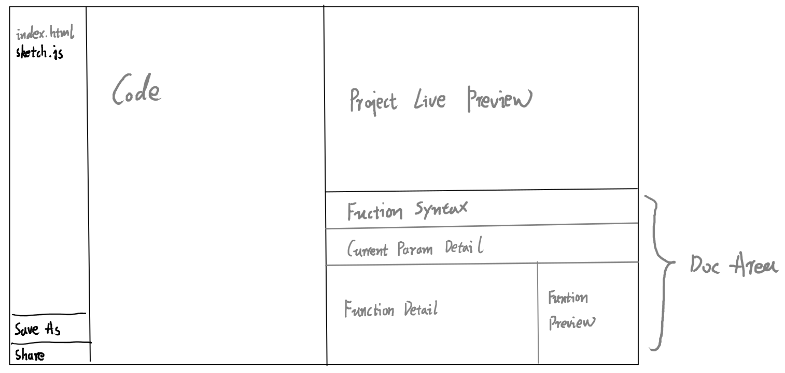
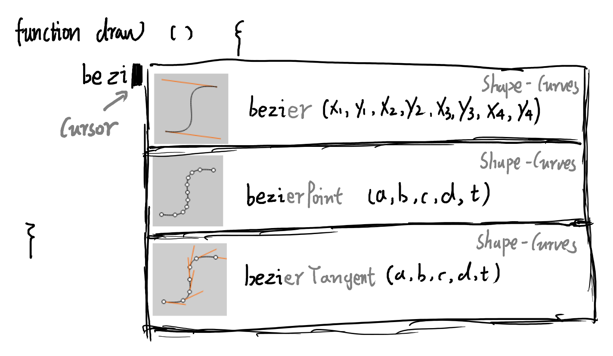
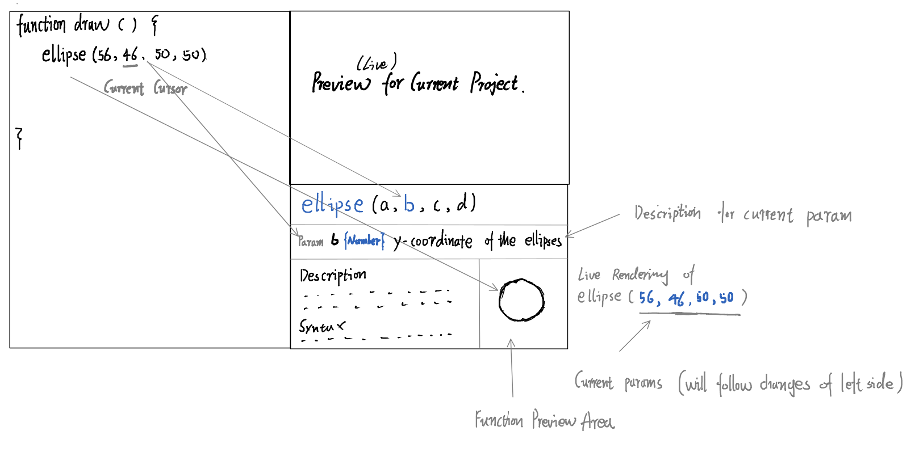
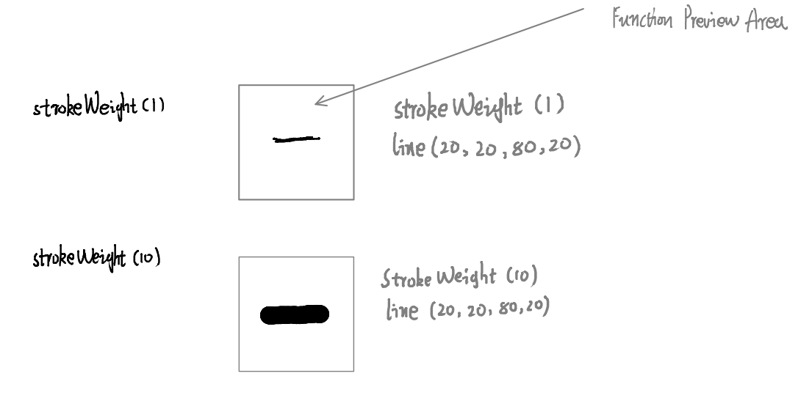
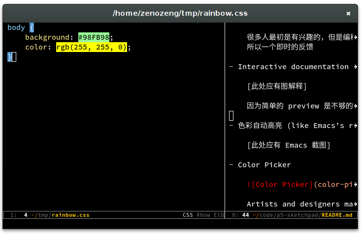
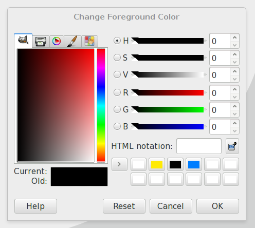

# IDE Design

Browser based p5.js IDE designed to
make coding accessible for artists, designers, educators, and beginner.

Here is a sketch of the IDE for introducing some core concepts.
Note that the UI will be redesigned when the project starts.

## Overview

## Features

### Basic

- Offline availability

    Using Appcache, Local Storage and IndexedDB.

- JSHint / JSLint

- Syntax Highlight

- Auto completion for standard JavaScript and p5.js.

    A completion menu with icon, syntax and category for each function.

    

### Import and Export

- Templates for new project

- Drag files in

- IndexedDB / LocalStorage based session

- Gif / PDF export

### Live Preview

- Live preview for current project

    很多人最初是有兴趣的，但是编程一开始的没有反馈会给他们带来挫败的感觉。
    所以一个即时的反馈

- Interactive documentation for current function and current params

    因为简单的 preview 是不够的，没有到那一帧就看不到，要等到。

    Simple preview for whole project is not enough.

    

    

- Highlight colors (like Emacs's rainbow mode)

    

- Color Picker

    

    Artists and designers may not have direct feeling for RGB.
    A color picker may be better for them.
    When click on expression like `background(255, 255, 255)`,
    a color picker will be displayed to help them choose the desired color.

### Social

- Share current project with a link (Node.js)

    用于 demo，设计师会非常常用这个

## FAQ

### Why browser based?

因为就我目前的观察，很多人会在下载 IDE 和安装使用他们的时候就感到挫败。
而且在浏览器还有个好处就是甚至可以在 ipad 上来使用它，而且更加易于分享。

### Why another browser based IDE?

现在已经有很多 Web IDE 了。但是这个是为写 p5.js 做优化了的。

### Will my project be public automatically when using this IDE?

No. Actually, this IDE will not upload project to server.
It's all client side code.

But one exception, if you click the share button,6
I love coding very much and am very interested in developing an IDE.
My girl friend is a designer and wants to learn some programming for Data Visualization.
I want to teach her p5.js later this summer vacation and I want to build a easy-to-use IDE for her.

My resume: http://resume.zenozeng.com/english/

My GitHub: https://github.com/zenozeng

## Related API and Libraries

### Dragging folder

- [mozGetDataAt](http://stackoverflow.com/questions/11620939/is-there-a-mozilla-equivalent-to-webkitgetasentry)

- webkitGetAsEntry

## Special Thanks (alphabetical ordered)

Special thanks to the following people for give me suggestions to this project.

- [Chiyo](http://chiyo.me) (Designer)

- [DreaminginCodeZH](https://github.com/DreaminginCodeZH) (Android Developer)

- [Senorsen](https://github.com/Senorsen) (devOps)
